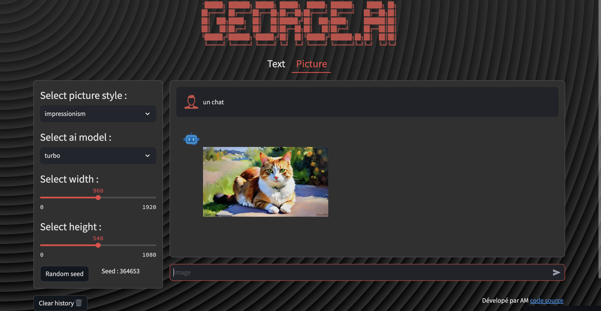

## 
 
Ce projet permet d'utiliser totalement gratuitement Chat GPT à l'aide du projet suivant [G4F API](https://github.com/xtekky/gpt4free) créé par [xtekky](https://github.com/xtekky).
Pour la génération d'image le projet utilise [pollination.ai](https://pollinations.ai/).

## Lien vers l'application

- [George.ai](https://george-ai.streamlit.app/)
- [George.ai shortcut apple](https://george-ai.streamlit.app/)
## Page principale :

## Page génération d'image :

